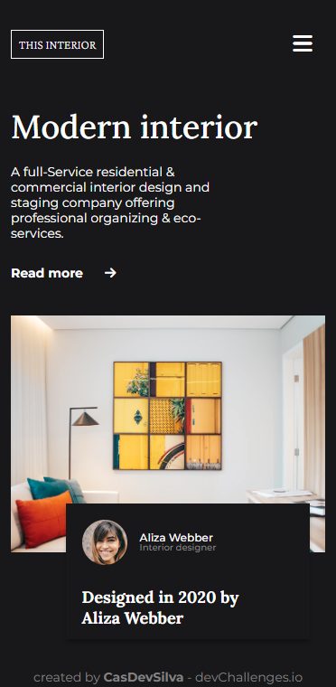

<!-- Please update value in the {}  -->

<h1 align="center">Interior Design</h1>

   Solution for a challenge from  <a href="http://devchallenges.io" target="_blank">Devchallenges.io</a>.

  <h3>
    <a href="https://jocular-gelato-0d458d.netlify.app/">
      Demo
    </a>
     | 
    <a href="https://github.com/CasDevSilva/Interior-Consultant">
      Solution
    </a>
     | 
    <a href="https://devchallenges.io/challenges/Jymh2b2FyebRTUljkNcb">
      Challenge
    </a>
  </h3>

## Contact

- GitHub [@CasDevSilva](https://github.com/CasDevSilva)
